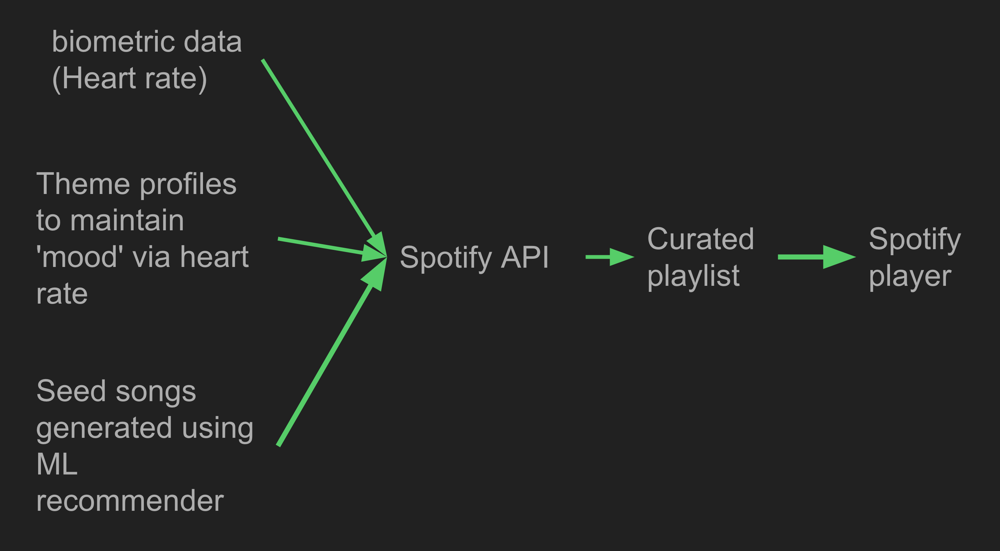
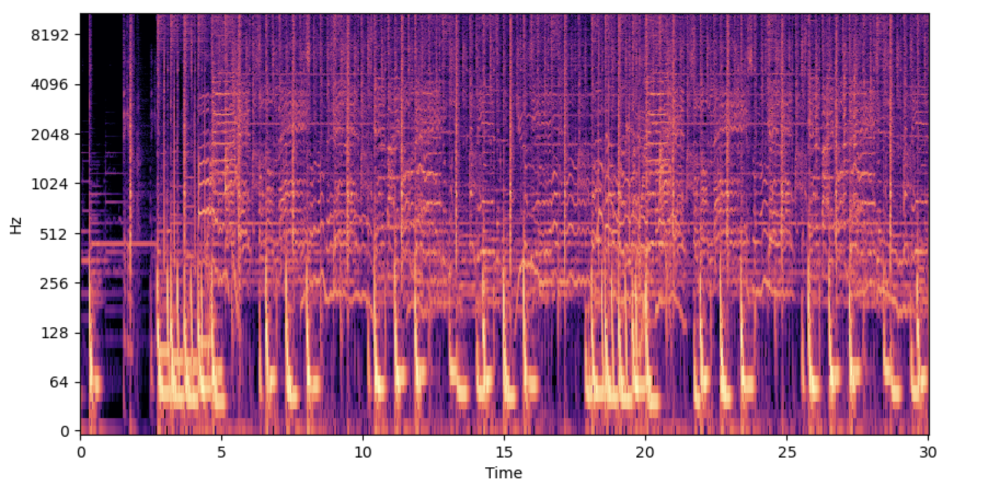

# beatRoot_MC


<p align="center">
    
</p>

Beatroot is a music player that can create dynamic music playlists based on bio-metric data such as Heart Rate. Given a target activity (i.e excercise, study) and given a reference song a user prefers, the music player will create a playlist that suits the target activity. The heart rate is used to measure the user's 'mood' to see if it matches the target activity. If the perceived mood does not match the target activity, the player will recurate the playlist real time to achieve the desired mood for the target activity.


<p align="center">
    
<p>


## How to run it
1. Create a Spotify Developer account and create an app.  [see gettting started with Web API](https://developer.spotify.com/documentation/web-api)

2. Set the following environment variables for ID and Secret obtained from the spotify developer dashboard. [see - App](https://developer.spotify.com/documentation/web-api/concepts/apps)
    ```bash
    export SPOTIFY_ID="your_spotify_id"
    export SPOTIFY_SECRET="your_spotify_secret"
    ```

3. Run the following command 
    ```bash
        python ./beatRootPlayer/beatRoot.py
    ```


## Architecture

<p align="center">
    
</p>

## Song matching 

To match seed songs which have similar 'feel' to the song a user prefers employs several steps.
1. A song dataset is collected
2. Songs are converted to Mel Spectrograms 
3. The Mel Spectrograms are passed through a CNN that has been pre-trained on Song Genre classifications
4. Song embeddings are extracted from the CNNs
5. Embeddings are used to locate the seed songs 


<p align="center">
    
    <p align="center">sample mel spectrogram of a song extracted using Librosa</p>
</p>


## Team 
1. Music player - Austin Copley 
2. Song matching research and development
    - Chatura Samarasinghe - 
    - YeJoon Jung -